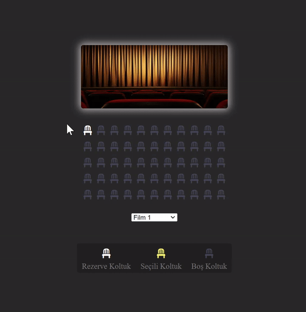

<h1> Sinema Rezervasyon Projesi</h1>

Bu proje HTML, CSS ve JavaScript kullanılarak geliştirilmiş  bir sinema koltuk rezervasyon uygulamasıdır. Kullanıcılar belirli bir film seçerek koltukları görebilir, istedikleri koltukları seçebilir ve rezerve edebilirler. Ayrıca her filmin farklı bir fiyatlandırması bulunmaktadır ve seçilen koltuk sayısına göre toplam ücret dinamik olarak hesaplanmaktadır.

<h2> Bölümler</h2>

<ul>
<li> <b>Sinema Perdesi ve Koltuklar: </b> Sayfa üzerinde sinema perdesi ve koltukları içeren görsel bir alan bulunmaktadır.</li>
<li><b>Koltuk Durumu: </b> Koltuklar rezerve edilmiş, seçilmiş veya boş durumlarını belirtmek üzere farklı renk ve simgelerle gösterilmektedir.</li>
<li><b>Film Seçimi ve Fiyatlandırma:</b> Kullanıcılar film seçimini bir açılır menü aracılığıyla yapabilirler. Her film için ayrı bir fiyat belirlenmiştir.</li>
<li><b>Koltuk Bilgisi ve Ücret Hesaplama:</b> Seçilen koltuk sayısı ve seçilen filmin fiyatı dikkate alınarak toplam ücret dinamik olarak hesaplanmaktadır.</li>
<li><b>Veritabanına Kaydetme ve Okuma:</b> Kullanıcıların seçtikleri koltukları, filmleri ve rezervasyon bilgilerini tarayıcı veritabanına kaydetme ve geri alma özelliği bulunmaktadır.</li>
</ul>

<h2> Fiyatlandırma </h2>
<ul>
<li><b>Film1:</b> 100 TL</li>
<li><b>Film2:</b> 200TL</li>
<li><b>Film3:</b> 300TL </li>
</ul>

<h2> JavaScript Kodları Açıklama</h2>

<ul>
<li> <b>'saveToDatabase' </b> ve  <b>'getFromDatabase' </b>  fonksiyonları seçilen koltukları, filmleri ve rezervasyon bilgilerini tarayıcı veritabanına kaydeder ve geri alır.</li>
<li><b>'createIndex'</b>  fonksiyonu tüm koltukları ve seçili koltukları kullanarak koltukların indekslerini oluşturur.</li>
<li><b>'calculateTotal'</b> fonksiyonu seçili koltuk sayısını ve seçilen filmin fiyatını dikkate alarak toplam ücreti hesaplar, bu bilgileri kullanıcıya gösterir ve veritabanına kaydeder </li>

</ul>

<h2> Kullanılan Teknolojiler </h2>
<ul>
<li>HTML5</li>
<li>CSS</li>
<li>JavaScript</li>
</ul>

<h2>Ekran Görüntüsü</h2>

